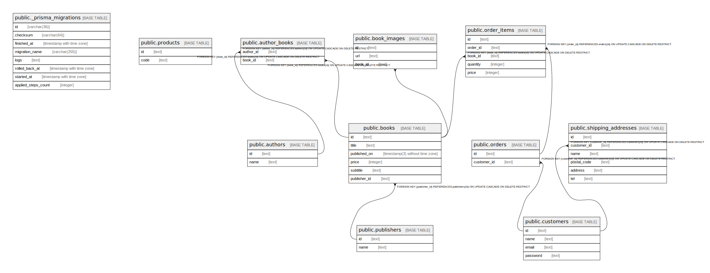

# app

## テーブル一覧

| 名前 | カラム一覧 | コメント | タイプ |
| ---- | ------- | ------- | ---- |
| [public._prisma_migrations](public._prisma_migrations.md) | 8 |  | BASE TABLE |
| [public.products](public.products.md) | 2 | 商品 | BASE TABLE |
| [public.books](public.books.md) | 6 | 書籍 | BASE TABLE |
| [public.publishers](public.publishers.md) | 2 | 出版社 | BASE TABLE |
| [public.authors](public.authors.md) | 2 | 著者 | BASE TABLE |
| [public.author_books](public.author_books.md) | 2 | 著者と書籍の関連 | BASE TABLE |
| [public.book_images](public.book_images.md) | 3 | 書籍画像 | BASE TABLE |
| [public.customers](public.customers.md) | 4 | 顧客 | BASE TABLE |
| [public.orders](public.orders.md) | 2 | 注文 | BASE TABLE |
| [public.order_items](public.order_items.md) | 5 | 注文明細 | BASE TABLE |
| [public.shipping_addresses](public.shipping_addresses.md) | 6 | 配送先 | BASE TABLE |

## ER図

---

> Generated by [tbls](https://github.com/k1LoW/tbls)
