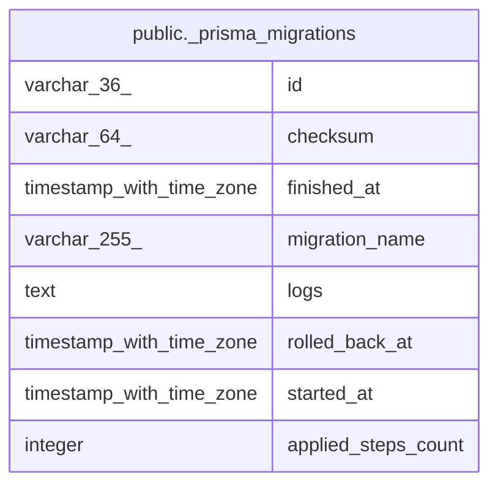

# public._prisma_migrations

## 概要

## カラム一覧

| 名前 | タイプ | デフォルト値 | Nullable | 子テーブル | 親テーブル | コメント |
| ---- | ------ | ------------ | -------- | ---------- | ---------- | -------- |
| id | varchar(36) |  | false |  |  |  |
| checksum | varchar(64) |  | false |  |  |  |
| finished_at | timestamp with time zone |  | true |  |  |  |
| migration_name | varchar(255) |  | false |  |  |  |
| logs | text |  | true |  |  |  |
| rolled_back_at | timestamp with time zone |  | true |  |  |  |
| started_at | timestamp with time zone | now() | false |  |  |  |
| applied_steps_count | integer | 0 | false |  |  |  |

## 制約一覧

| 名前 | タイプ | 定義 |
| ---- | ---- | ---------- |
| _prisma_migrations_pkey | PRIMARY KEY | PRIMARY KEY (id) |

## INDEX一覧

| 名前 | 定義 |
| ---- | ---------- |
| _prisma_migrations_pkey | CREATE UNIQUE INDEX _prisma_migrations_pkey ON public._prisma_migrations USING btree (id) |

## ER図

---

> Generated by [tbls](https://github.com/k1LoW/tbls)
