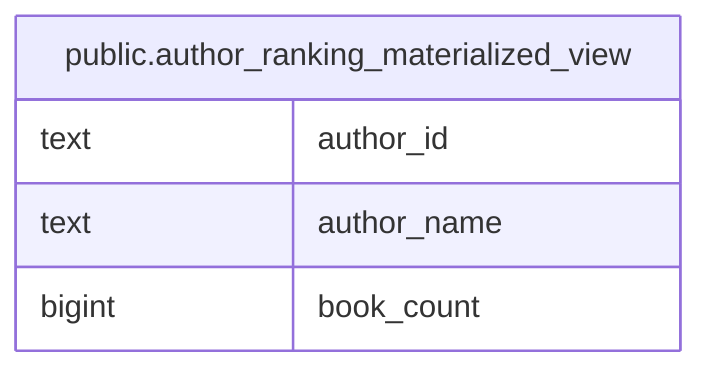

# public.author_ranking_materialized_view

## 概要

著者ごとの書籍販売数ランキングのマテビュー

<details>
<summary><strong>テーブル定義</strong></summary>

```sql
CREATE MATERIALIZED VIEW author_ranking_materialized_view AS (
 SELECT author_books.author_id,
    authors.name AS author_name,
    count(author_books.book_id) AS book_count
   FROM (author_books
     LEFT JOIN authors ON ((author_books.author_id = authors.id)))
  GROUP BY author_books.author_id, authors.name
  ORDER BY (count(author_books.book_id)) DESC
)
```

</details>

## Referenced Tables

- [public.author_books](public.author_books.md)
- [public.authors](public.authors.md)

## カラム一覧

| 名前 | タイプ | デフォルト値 | Nullable | 子テーブル | 親テーブル | コメント |
| ---- | ------ | ------------ | -------- | ---------- | ---------- | -------- |
| author_id | text |  | true |  |  | 著者ID |
| author_name | text |  | true |  |  | 著者名 |
| book_count | bigint |  | true |  |  | 書籍販売数 |

## Viewpoints

| 名前 | 定義 |
| ---- | ---------- |
| [書籍の購入](viewpoint-3.md) | 書籍を購入する際に関連するテーブルのまとまり。 顧客が購入できるためには、配送先が設定される必要がある。 配送時に参照される製品コードはproductsテーブルから取得される。 |

## ER図



---

> Generated by [tbls](https://github.com/k1LoW/tbls)
