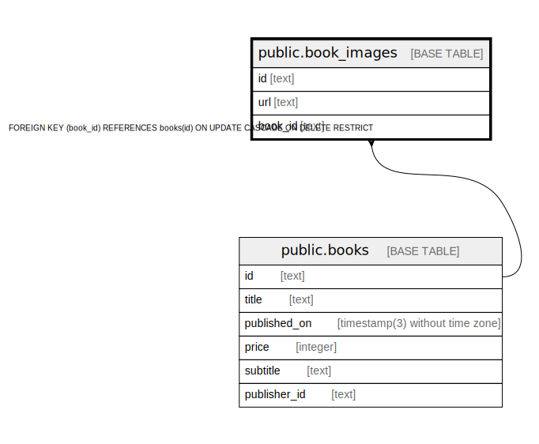

# public.book_images

## 概要

書籍画像

## カラム一覧

| 名前 | タイプ | デフォルト値 | Nullable | 子テーブル | 親テーブル | コメント |
| ---- | ------ | ------------ | -------- | ---------- | ---------- | -------- |
| id | text |  | false |  |  |  |
| url | text |  | false |  |  | 画像URL |
| book_id | text |  | false |  | [public.books](public.books.md) | 書籍ID |

## 制約一覧

| 名前 | タイプ | 定義 |
| ---- | ---- | ---------- |
| book_images_book_id_fkey | FOREIGN KEY | FOREIGN KEY (book_id) REFERENCES books(id) ON UPDATE CASCADE ON DELETE RESTRICT |
| book_images_pkey | PRIMARY KEY | PRIMARY KEY (id) |

## INDEX一覧

| 名前 | 定義 |
| ---- | ---------- |
| book_images_pkey | CREATE UNIQUE INDEX book_images_pkey ON public.book_images USING btree (id) |

## ER図

---

> Generated by [tbls](https://github.com/k1LoW/tbls)
