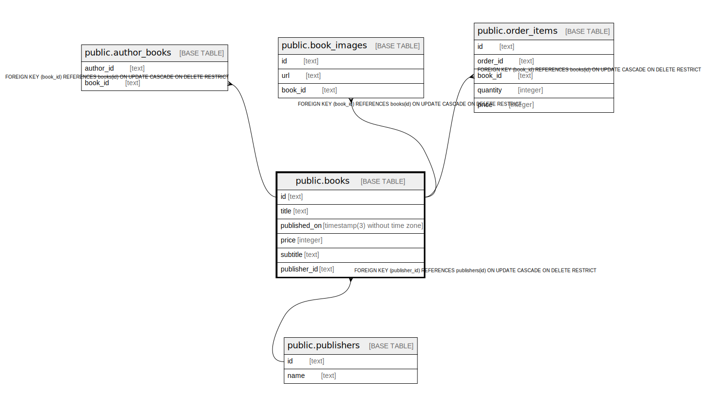

# public.books

## 概要

書籍

## カラム一覧

| 名前 | タイプ | デフォルト値 | Nullable | 子テーブル | 親テーブル | コメント |
| ---- | ------ | ------------ | -------- | ---------- | ---------- | -------- |
| id | text |  | false | [public.author_books](public.author_books.md) [public.book_images](public.book_images.md) [public.order_items](public.order_items.md) |  |  |
| title | text |  | false |  |  | 書籍名 |
| published_on | timestamp(3) without time zone |  | false |  |  | 出版日 |
| price | integer |  | false |  |  | 価格 |
| subtitle | text |  | false |  |  | サブタイトル |
| publisher_id | text |  | false |  | [public.publishers](public.publishers.md) | 出版社ID |

## 制約一覧

| 名前 | タイプ | 定義 |
| ---- | ---- | ---------- |
| books_pkey | PRIMARY KEY | PRIMARY KEY (id) |
| books_publisher_id_fkey | FOREIGN KEY | FOREIGN KEY (publisher_id) REFERENCES publishers(id) ON UPDATE CASCADE ON DELETE RESTRICT |

## INDEX一覧

| 名前 | 定義 |
| ---- | ---------- |
| books_pkey | CREATE UNIQUE INDEX books_pkey ON public.books USING btree (id) |

## ER図

---

> Generated by [tbls](https://github.com/k1LoW/tbls)
