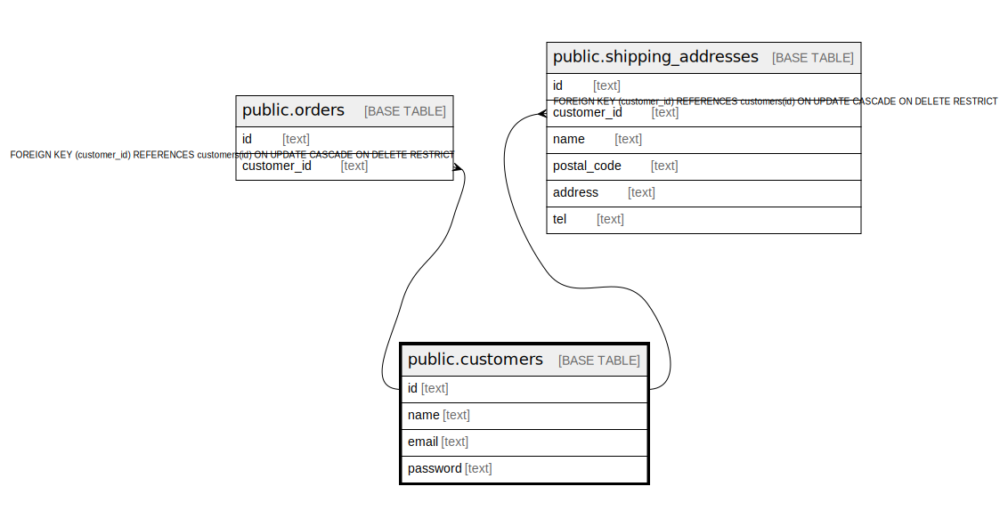

# public.customers

## 概要

顧客

## カラム一覧

| 名前 | タイプ | デフォルト値 | Nullable | 子テーブル | 親テーブル | コメント |
| ---- | ------ | ------------ | -------- | ---------- | ---------- | -------- |
| id | text |  | false | [public.orders](public.orders.md) [public.shipping_addresses](public.shipping_addresses.md) |  |  |
| name | text |  | false |  |  | 顧客名 |
| email | text |  | false |  |  | メールアドレス |
| password | text |  | false |  |  | パスワード |

## 制約一覧

| 名前 | タイプ | 定義 |
| ---- | ---- | ---------- |
| customers_pkey | PRIMARY KEY | PRIMARY KEY (id) |

## INDEX一覧

| 名前 | 定義 |
| ---- | ---------- |
| customers_pkey | CREATE UNIQUE INDEX customers_pkey ON public.customers USING btree (id) |

## ER図

---

> Generated by [tbls](https://github.com/k1LoW/tbls)
