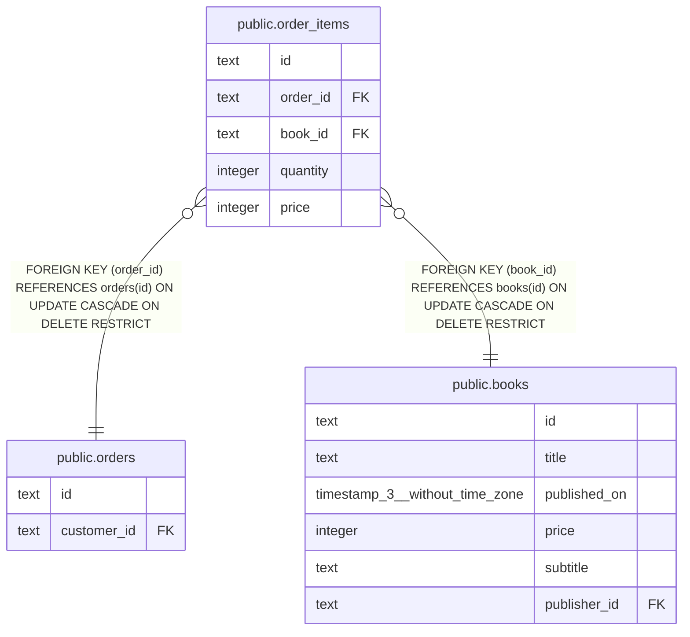

# public.order_items

## 概要

注文明細

## カラム一覧

| 名前 | タイプ | デフォルト値 | Nullable | 子テーブル | 親テーブル | コメント |
| ---- | ------ | ------------ | -------- | ---------- | ---------- | -------- |
| id | text |  | false |  |  |  |
| order_id | text |  | false |  | [public.orders](public.orders.md) | 注文ID |
| book_id | text |  | false |  | [public.books](public.books.md) | 書籍ID |
| quantity | integer |  | false |  |  |  |
| price | integer |  | false |  |  |  |

## 制約一覧

| 名前 | タイプ | 定義 |
| ---- | ---- | ---------- |
| order_items_book_id_fkey | FOREIGN KEY | FOREIGN KEY (book_id) REFERENCES books(id) ON UPDATE CASCADE ON DELETE RESTRICT |
| order_items_order_id_fkey | FOREIGN KEY | FOREIGN KEY (order_id) REFERENCES orders(id) ON UPDATE CASCADE ON DELETE RESTRICT |
| order_items_pkey | PRIMARY KEY | PRIMARY KEY (id) |

## INDEX一覧

| 名前 | 定義 |
| ---- | ---------- |
| order_items_pkey | CREATE UNIQUE INDEX order_items_pkey ON public.order_items USING btree (id) |

## ER図

---

> Generated by [tbls](https://github.com/k1LoW/tbls)
