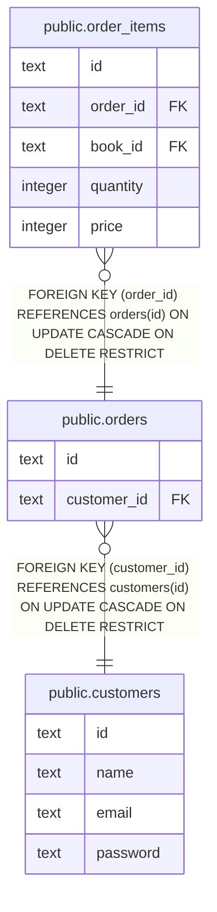

# public.orders

## 概要

注文

## カラム一覧

| 名前 | タイプ | デフォルト値 | Nullable | 子テーブル | 親テーブル | コメント |
| ---- | ------ | ------------ | -------- | ---------- | ---------- | -------- |
| id | text |  | false | [public.order_items](public.order_items.md) |  |  |
| customer_id | text |  | false |  | [public.customers](public.customers.md) | 顧客ID |

## Viewpoints

| 名前 | 定義 |
| ---- | ---------- |
| [書籍の購入](viewpoint-3.md) | 書籍を購入する |

## 制約一覧

| 名前 | タイプ | 定義 |
| ---- | ---- | ---------- |
| orders_customer_id_fkey | FOREIGN KEY | FOREIGN KEY (customer_id) REFERENCES customers(id) ON UPDATE CASCADE ON DELETE RESTRICT |
| orders_pkey | PRIMARY KEY | PRIMARY KEY (id) |

## INDEX一覧

| 名前 | 定義 |
| ---- | ---------- |
| orders_pkey | CREATE UNIQUE INDEX orders_pkey ON public.orders USING btree (id) |

## ER図

---

> Generated by [tbls](https://github.com/k1LoW/tbls)
