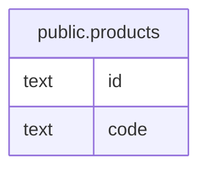

# public.products

## 概要

商品

## カラム一覧

| 名前 | タイプ | デフォルト値 | Nullable | 子テーブル | 親テーブル | コメント |
| ---- | ------ | ------------ | -------- | ---------- | ---------- | -------- |
| id | text |  | false |  |  |  |
| code | text |  | false |  |  | 商品コード |

## Viewpoints

| 名前 | 定義 |
| ---- | ---------- |
| [書籍の追加](viewpoint-0.md) | 書籍を追加する際に関連するテーブルのまとまり |
| [書籍の購入](viewpoint-3.md) | 書籍を購入する際に関連するテーブルのまとまり。 顧客が購入できるためには、配送先が設定される必要がある。 配送時に参照される製品コードはproductsテーブルから取得される。 |

## 制約一覧

| 名前 | タイプ | 定義 |
| ---- | ---- | ---------- |
| products_pkey | PRIMARY KEY | PRIMARY KEY (id) |

## INDEX一覧

| 名前 | 定義 |
| ---- | ---------- |
| products_pkey | CREATE UNIQUE INDEX products_pkey ON public.products USING btree (id) |
| products_code_key | CREATE UNIQUE INDEX products_code_key ON public.products USING btree (code) |

## ER図

---

> Generated by [tbls](https://github.com/k1LoW/tbls)
