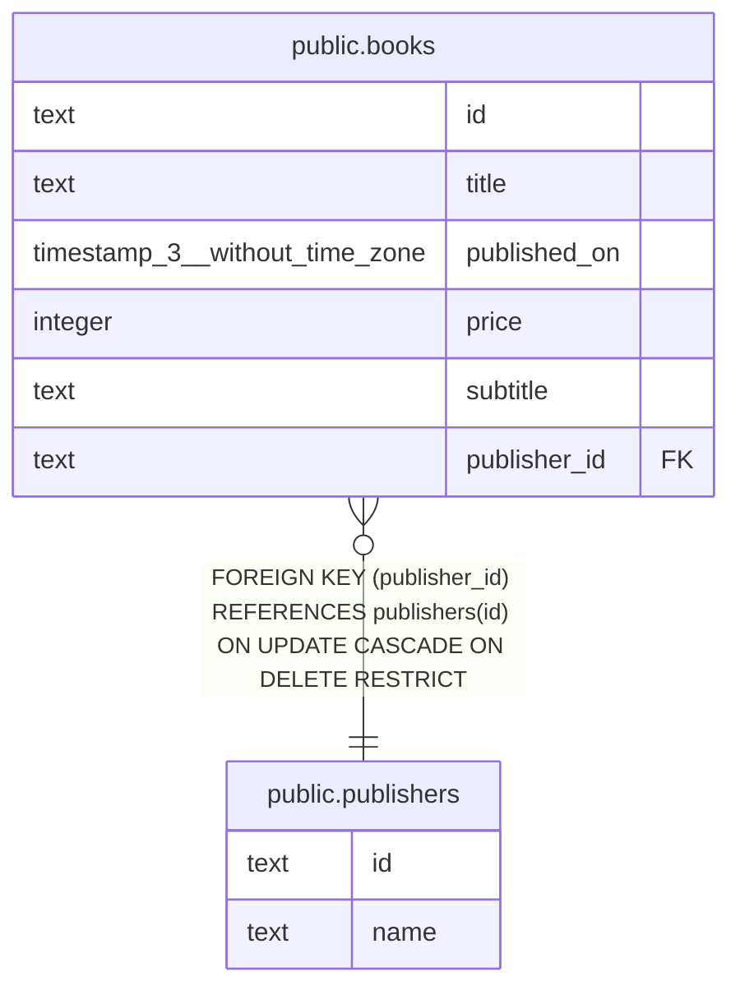

# public.publishers

## 概要

出版社

## カラム一覧

| 名前 | タイプ | デフォルト値 | Nullable | 子テーブル | 親テーブル | コメント |
| ---- | ------ | ------------ | -------- | ---------- | ---------- | -------- |
| id | text |  | false | [public.books](public.books.md) |  |  |
| name | text |  | false |  |  | 出版社名 |

## Viewpoints

| 名前 | 定義 |
| ---- | ---------- |
| [書籍の追加](viewpoint-0.md) | 書籍を追加する際に関連するテーブルのまとまり |

## 制約一覧

| 名前 | タイプ | 定義 |
| ---- | ---- | ---------- |
| publishers_pkey | PRIMARY KEY | PRIMARY KEY (id) |

## INDEX一覧

| 名前 | 定義 |
| ---- | ---------- |
| publishers_pkey | CREATE UNIQUE INDEX publishers_pkey ON public.publishers USING btree (id) |

## ER図

---

> Generated by [tbls](https://github.com/k1LoW/tbls)
