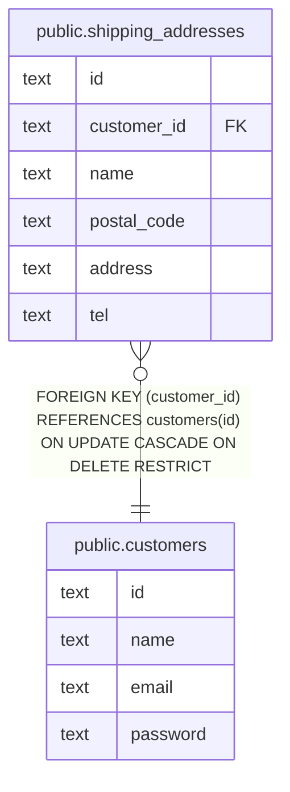

# public.shipping_addresses

## 概要

配送先

## カラム一覧

| 名前 | タイプ | デフォルト値 | Nullable | 子テーブル | 親テーブル | コメント |
| ---- | ------ | ------------ | -------- | ---------- | ---------- | -------- |
| id | text |  | false |  |  |  |
| customer_id | text |  | false |  | [public.customers](public.customers.md) | 顧客ID |
| name | text |  | false |  |  | 名前 |
| postal_code | text |  | false |  |  | 郵便番号 |
| address | text |  | false |  |  | 住所 |
| tel | text |  | false |  |  | 電話番号 |

## Viewpoints

| 名前 | 定義 |
| ---- | ---------- |
| [配送先の追加](viewpoint-2.md) | 配送先を追加する際に関連するテーブルのまとまり |
| [書籍の購入](viewpoint-3.md) | 書籍を購入する際に関連するテーブルのまとまり。 顧客が購入できるためには、配送先が設定される必要がある。 配送時に参照される製品コードはproductsテーブルから取得される。 |

## 制約一覧

| 名前 | タイプ | 定義 |
| ---- | ---- | ---------- |
| shipping_addresses_customer_id_fkey | FOREIGN KEY | FOREIGN KEY (customer_id) REFERENCES customers(id) ON UPDATE CASCADE ON DELETE RESTRICT |
| shipping_addresses_pkey | PRIMARY KEY | PRIMARY KEY (id) |

## INDEX一覧

| 名前 | 定義 |
| ---- | ---------- |
| shipping_addresses_pkey | CREATE UNIQUE INDEX shipping_addresses_pkey ON public.shipping_addresses USING btree (id) |

## ER図

---

> Generated by [tbls](https://github.com/k1LoW/tbls)
