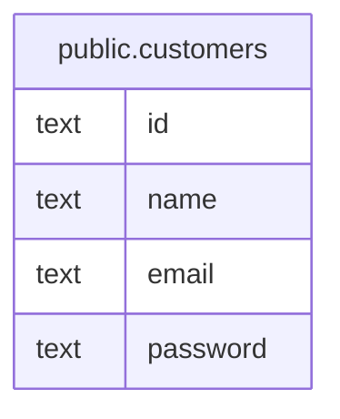

# 顧客の追加

## 概要

顧客を追加する

## テーブル一覧

| 名前 | カラム一覧 | コメント | タイプ |
| ---- | ------- | ------- | ---- |
| [public.customers](public.customers.md) | 4 | 顧客 | BASE TABLE |

## ER図

---

> Generated by [tbls](https://github.com/k1LoW/tbls)
