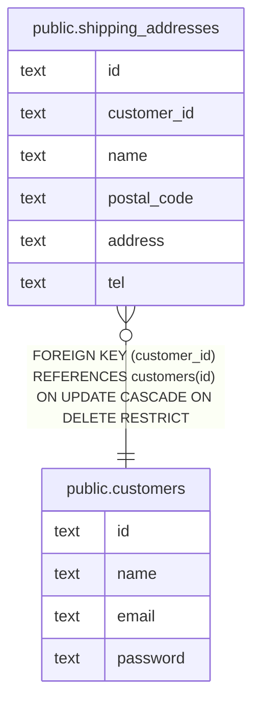

# 配送先の追加

## 概要

配送先を追加する際に関連するテーブルのまとまり

## テーブル一覧

| 名前 | カラム一覧 | コメント | タイプ |
| ---- | ------- | ------- | ---- |
| [public.customers](public.customers.md) | 4 | 顧客 | BASE TABLE |
| [public.shipping_addresses](public.shipping_addresses.md) | 6 | 配送先 | BASE TABLE |

## ER図

---

> Generated by [tbls](https://github.com/k1LoW/tbls)
