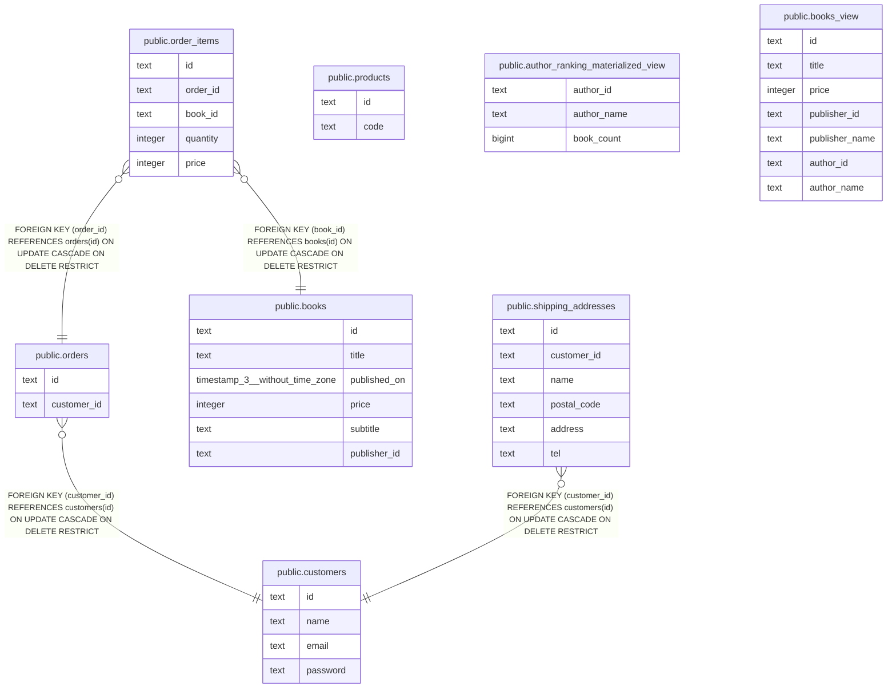

# 書籍の購入

## 概要

書籍を購入する際に関連するテーブルのまとまり。 顧客が購入できるためには、配送先が設定される必要がある。 配送時に参照される製品コードはproductsテーブルから取得される。

## テーブル一覧

### View

関連するビュー

| 名前 | カラム一覧 | コメント | タイプ |
| ---- | ------- | ------- | ---- |
| [public.books_view](public.books_view.md) | 7 | 書籍のビュー | VIEW |

### Materialized View

関連するマテリアライズドビュー

| 名前 | カラム一覧 | コメント | タイプ |
| ---- | ------- | ------- | ---- |
| [public.author_ranking_materialized_view](public.author_ranking_materialized_view.md) | 3 | 著者ごとの書籍販売数ランキングのマテビュー | MATERIALIZED VIEW |

### -

| 名前 | カラム一覧 | コメント | タイプ |
| ---- | ------- | ------- | ---- |
| [public.products](public.products.md) | 2 | 商品：社内全体で管理されている商品コードを格納 | BASE TABLE |
| [public.books](public.books.md) | 6 | 書籍 | BASE TABLE |
| [public.customers](public.customers.md) | 4 | 顧客 | BASE TABLE |
| [public.orders](public.orders.md) | 2 | 注文：注文の確定ごとに作成される。請求処理は注文の重複がないかどうか確認されてから行われるため、必ずしも対応関係ではない。 | BASE TABLE |
| [public.order_items](public.order_items.md) | 5 | 注文明細 | BASE TABLE |
| [public.shipping_addresses](public.shipping_addresses.md) | 6 | 配送先 | BASE TABLE |

## ER図

---

> Generated by [tbls](https://github.com/k1LoW/tbls)
